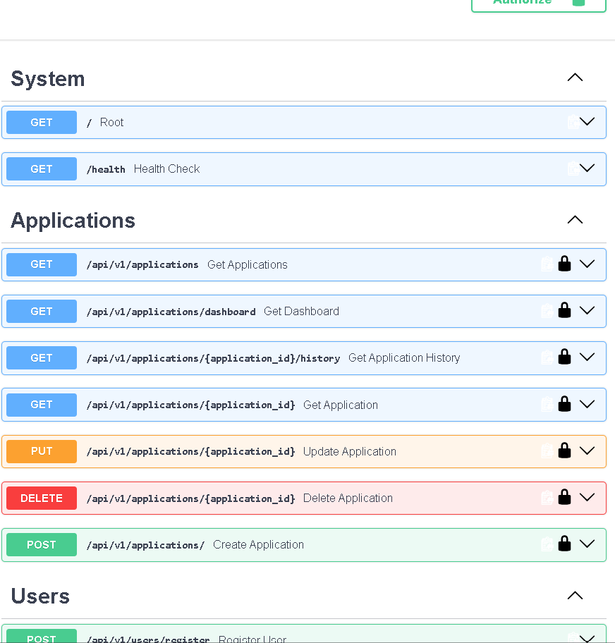
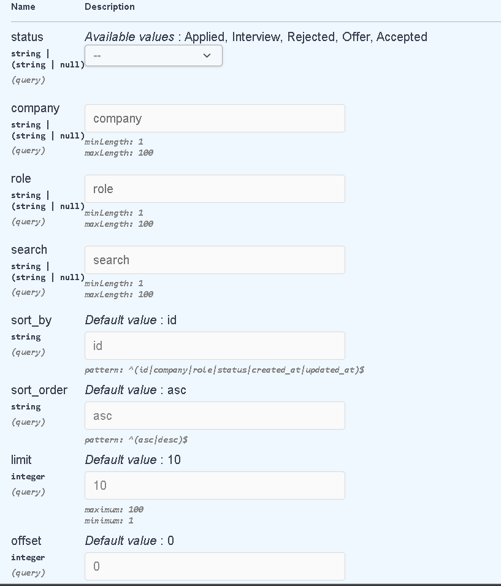
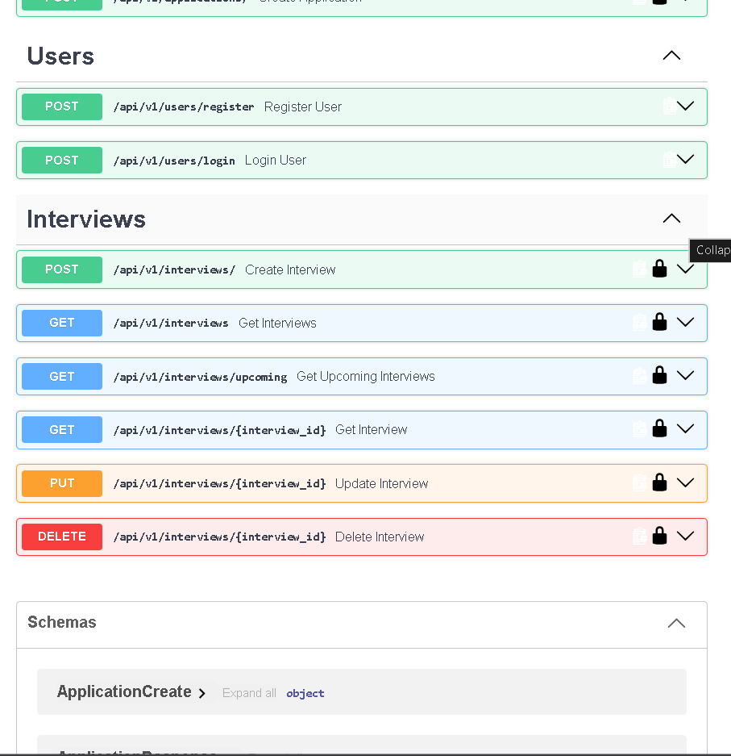
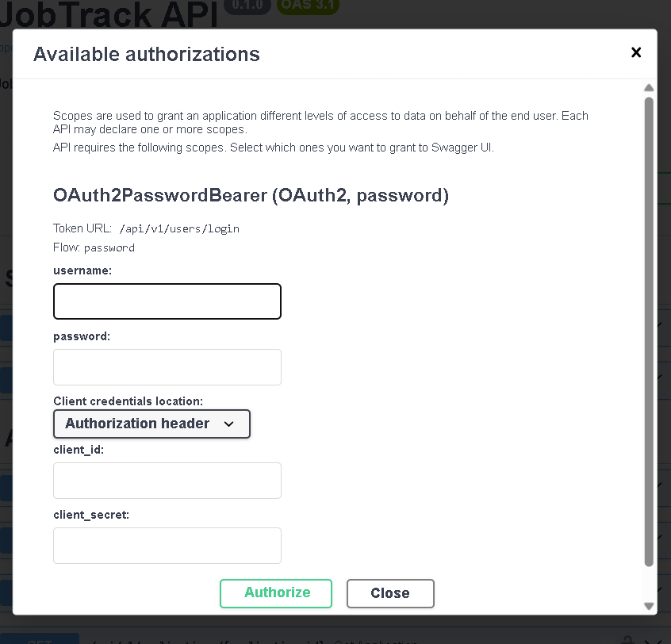

@'
# JobTrack API
[](https://github.com/ShaikTanveer8247/Jobtrack-api/actions/workflows/tests.yml)

A production-style Job Application and Interview Tracking REST API built with Python, FastAPI, SQLAlchemy, and MySQL.

## Features

- JWT authentication
- Application CRUD
- Interview tracking
- Status history
- Search, filtering, sorting, and pagination
- User ownership and authorization
- Automated tests
- GitHub Actions CI
- API versioning

### Authentication

- User registration
- Secure password hashing with Argon2
- JWT authentication
- Protected API endpoints
- User-specific application ownership

### Applications

- Create, read, update, and delete applications
- Status tracking:
  - Applied
  - Interview
  - Rejected
  - Offer
  - Accepted
- Search by company or role
- Filter by status, company, and role
- Pagination with limit and offset
- Sorting by ID, company, role, status, created time, and updated time
- Duplicate application protection
- Created and updated timestamps

### Dashboard

- Total application count
- Status-based statistics
- Five most recently updated applications

### Status History

- Automatically records status changes
- View the complete status timeline for an application

### Interviews

- Create and manage interviews
- Interview rounds
- Interview date and time
- Notes
- Interview result
- Upcoming interview endpoint
- User ownership protection
- Cascade deletion when an application is deleted

### Testing

- Pytest test suite
- In-memory SQLite test database
- CRUD tests
- Duplicate protection tests
- Status history tests
- User ownership and security tests
- Interview tests
- Authentication integration tests

## Tech Stack

- Python 3.13
- FastAPI
- SQLAlchemy
- MySQL
- PyMySQL
- Pydantic
- PyJWT
- Argon2 password hashing
- Pytest
- HTTPX
- Uvicorn
- GitHub Actions

## Project Structure

```text
Jobtrack-api/
│
├── app/
│   ├── core/
│   │   ├── dependencies.py
│   │   ├── jwt.py
│   │   └── security.py
│   │
│   ├── routers/
│   │   ├── application.py
│   │   ├── interview.py
│   │   └── user.py
│   │
│   ├── schemas/
│   │   ├── application.py
│   │   ├── common.py
│   │   ├── interview.py
│   │   ├── status.py
│   │   └── user.py
│   │
│   ├── database.py
│   ├── models.py
│   └── main.py
│
├── tests/
│   ├── conftest.py
│   ├── test_application.py
│   ├── test_interview.py
│   ├── test_system.py
│   └── test_user.py
│
├── .github/
│   └── workflows/
│       └── tests.yml
│
├── .gitignore
├── .python-version
├── pytest.ini
├── requirements.txt
└── README.md


Architecture

Client
   │
   ▼
FastAPI
   │
   ├── Authentication
   │      └── JWT + Argon2
   │
   ├── Application Router
   │      ├── CRUD
   │      ├── Search
   │      ├── Filtering
   │      ├── Sorting
   │      ├── Pagination
   │      └── Status History
   │
   ├── Interview Router
   │      ├── CRUD
   │      └── Upcoming Interviews
   │
   ▼
SQLAlchemy
   │
   ▼
MySQL

API Endpoints

Authentication

| Method | Endpoint                 |
| ------ | ------------------------ |
| POST   | `/api/v1/users/register` |
| POST   | `/api/v1/users/login`    |


Applications

| Method | Endpoint                            |
| ------ | ----------------------------------- |
| GET    | `/api/v1/applications`              |
| POST   | `/api/v1/applications/`             |
| GET    | `/api/v1/applications/{id}`         |
| PUT    | `/api/v1/applications/{id}`         |
| DELETE | `/api/v1/applications/{id}`         |
| GET    | `/api/v1/applications/dashboard`    |
| GET    | `/api/v1/applications/{id}/history` |


Interviews

| Method | Endpoint                      |
| ------ | ----------------------------- |
| GET    | `/api/v1/interviews`          |
| POST   | `/api/v1/interviews/`         |
| GET    | `/api/v1/interviews/upcoming` |
| GET    | `/api/v1/interviews/{id}`     |
| PUT    | `/api/v1/interviews/{id}`     |
| DELETE | `/api/v1/interviews/{id}`     |


System
| Method | Endpoint  |
| ------ | --------- |
| GET    | `/health` |
| GET    | `/docs`   |


Database Schema

users
  │
  │ 1
  │
  └──────────< applications
                  │
                  ├──────────< interviews
                  │
                  └──────────< application_status_history


Main Tables

users
.id
.email
.password_hash

applications

id
.user_id
.company
.role
.status
.created_at
.updated_at

Interviews

.id
.application_id
.round
.interview_date
.notes
.result

application_status_history

.id
.application_id
.old_status
.new_status
.changed_at

Testing

The project uses Pytest with an in-memory SQLite database for automated testing.

Current test result:

20 passed, 2 warnings

Tests cover:

.User registration and login
.JWT authentication
.Protected endpoints
.Application CRUD
.Interview CRUD
.Duplicate application protection
.Status history
.User ownership and authorization
.Health check

## Local Setup

.Clone the repository

git clone https://github.com/ShaikTanveer8247/Jobtrack-api.git
cd Jobtrack-api

Create a virtual environment

python -m venv venv

Activate the virtual environment

Windows PowerShell:

.\venv\Scripts\Activate.ps1

Install dependencies

pip install -r requirements.txt

Configure environment variables

create a .env file in the project root:

DB_USER=your_mysql_user
DB_PASSWORD=your_mysql_password
DB_HOST=localhost
DB_PORT=3306
DB_NAME=jobtrack
JWT_SECRET_KEY=your_secret_key

Do not commit .env to Github


## Run the API

python -m uvicorn app.main:app --reload

## API Documentation

http://127.0.0.1:8000/docs

## Swagger API Screenshots

### API Overview



### Application Filtering, Search, Sorting and Pagination



### Users and Interviews



### JWT Authentication



## Health Check

http://127.0.0.1:8000/health

Expected response:
 JSON
 {
  "status": "ok"
}

## Example API Flow

Register User
     │
     ▼
Login
     │
     ▼
Receive JWT Access Token
     │
     ▼
Create Job Application
     │
     ▼
Update Application Status
     │
     ▼
Status History Recorded
     │
     ▼
Create Interview
     │
     ▼
View Dashboard


## GitHub Actions

GitHub Actions automatically runs the Pytest test suite when changes are pushed to the repository or submitted through a pull request.

## API Documentation

FastAPI provides interactive Swagger documentation at:

http://127.0.0.1:8000/docs

ReDoc is available at:

http://127.0.0.1:8000/redoc

##Author

Shaik Tanveer

GitHub: https://github.com/ShaikTanveer8247


```powershell
git diff --check

No output = good.
